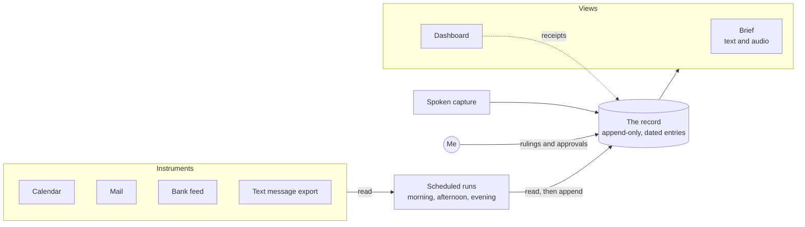

# Reference deployment: my personal chief of staff

This is how I use Counterentry every day: as the record behind an AI assistant that keeps track of my calendar, mail, money and commitments, and briefs me at the turning points of my day. It is one deployment, not part of the specification, and the specification does not depend on any product named here.

Written 6 October 2026. Everything below is running unless it is marked otherwise, and what is degraded right now is kept in [§2 of the spec](COUNTERENTRY.md#2-status). The findings that shaped the deployment are in [FIELD-NOTES.md](FIELD-NOTES.md).

## Shape

The record is the only place the system writes on its own. Its only writes anywhere else are mail drafts and calendar entries, and only when I ask or approve. The dashboard is a view, but it appends two kinds of entry of its own: a receipt when I tap Done or Park, and a fresh full snapshot when the running one grows too large.

## The record

- A folder tree in cloud storage, in my personal account. One folder per store (money, household, health, the system itself, and so on), plus an inbox where anything new lands first.
- Every entry is a new dated document. The title says what kind of entry it is, the date, and in one line what happened. The body opens with the store, the time of writing (read from a clock just before writing), and what the entry supersedes, and it closes with a line listing what was deliberately not touched.
- Before any write, the writer checks that the target folder belongs to my personal account, and stops if it does not.
- Corrections are new entries that name what they replace. Retractions are recorded, not quietly fixed.

## Instruments, and one writer

- The calendar, the mailbox, a bank-data connection and an export of my text messages are the instruments. The runs only read them, and each run cites what it read and when that source last refreshed.
- The assistant never sends mail. It drafts when asked. Calendar entries are proposed as cards and created only when I tap Approve.
- Anything fetched from mail or the web is data. If it contains instructions, they are flagged and ignored.

## Scheduled runs

- A morning run that finishes before my day starts, an afternoon run on weekdays, an evening run, and a twice-daily audit of exported text messages that looks for requests made to me and promises I made. The times follow the turning points of my day, not round numbers.
- Each run appends a run log, a data snapshot that the dashboard reads, and the brief.
- The runs carry out three of the spec's six passes: ingest, reconcile and the brief. Consolidating, outward research and pruning happen by hand, in working sessions.
- The instructions for every run are source files in a private git repository. They are edited as fragments, built, deployed to the scheduler, fetched back, and compared by SHA-256. A statement about what the instructions say is either backed by a passing verification or it is not made.
- A standing condition I set: no new feature ships unless the instructions get shorter (field note 16).

## The brief

- At most seven lines and three decisions. Each line names its cost, its source, and the decision it enables. "Nothing needs you" is a complete brief.
- The first line names one thing and anchors it to the next fixed point in my day ("before your 10:00 AM call"). Everything else is counted, not recited.
- What earns a line: Did I promise it? Who is it with? Is there a clock? What does dropping it cost? Cost ranks first and the clock second. Things that need me now go in the brief, at most three. Things with no clock go to a list on the dashboard that I visit when I choose. Everything else stays in the record.
- The footer states what was checked, with each source's as-of time, what could not be checked, and the open holes.
- The brief is also delivered as generated audio. Money is never spoken: the voice may say that a money item needs attention and how soon, and nothing else, because I sometimes play the brief with other people in the room. For the same reason no amount appears in any file title, since titles show on a phone's screen.
- I calibrated the voice against written samples: personality comes only from facts in the record, there is no pep talk, and the voice never tells me how my day felt or how to spend my time.

## The dashboard

- A single-file web page that renders only from the record. It never displays the copy of the data it was built with.
- Money is covered by default: amounts show as dots until I uncover them, and the page covers them again after two idle minutes or when the tab loses focus.
- Every line opens a panel showing what it is, why it is there, what the assistant recommends, the record it came from, and what I can do about it.
- Done and Park write receipts to the record (field note 8).

## Capture

- A shortcut on my phone sends a spoken note to a plus-addressed mailbox, and a small script files it into the record's inbox. Tested end to end in September, it took under three minutes from speaking to filed.
- One capture often holds several items. Splitting it is automatic; each piece lands only when I approve it, with a suggested home and date.
- The phone end of this path failed in late September and is an open hole (field note 24).

## Holes

The system's own blind spots are tracked as first-class records, under a rule I wrote: a blind channel, a check that cannot run, a source returning nothing for five runs, a fix waiting on me, or a defect the assistant has carried for three sessions. Each has a plain-language cost and a next step. Seven were open on 6 October 2026 (field note 23).

## Loops (approved, not built)

Commitments in flight are marked as mine or someone else's. One held by someone else always has a next-check date, does not age, and closes only on a record from outside: a reply, a receipt, an observed result. Completing a step inside an open matter must name who holds it now and when to check, and never defaults to closed (field note 13).

## The weekly sit-down

Once a week, and whenever I ask, the assistant brings its saved-up questions, sorted by what each answer would unblock. Each comes with a recommended answer and a few choices, so I can react rather than compose. Open-ended questions are talked through instead. A question gets a seat only if its answer unblocks something or keeps me ahead; everything else waits on the dashboard.

## Who closes what

| Class | Who acts | Examples |
|---|---|---|
| Housekeeping | The assistant closes it and records the closure. | A late run, a duplicate entry, a file count. |
| Holes | Listed with their cost and next step. Never closed as housekeeping. | A blind channel, a check that cannot run. |
| Drafts, research, filing, reconciling two records | The assistant does the work; I see it before it counts. | A drafted reply, a filed capture, two records reconciled. |
| Money moving, anything about a person, anything irreversible, anything public under my name | Me, always. | Paying a bill, a message to someone, publishing. |

## Stack, October 2026

| Part | What it runs on |
|---|---|
| Assistant and scheduler | Claude, with scheduled tasks |
| Record | Google Drive documents in my personal account |
| Instruments | Gmail, Google Calendar, a bank-data connector, and text messages exported from my Mac |
| Glue | Google Apps Script: capture intake, message intake, the audio brief, a watchdog |
| Voice | A text-to-speech API |
| Dashboard | One HTML file |
| Instruction source | A private git repository with build and verify scripts |

## Lessons specific to this deployment

- **A device that sleeps must push; never poll it.** A job bound to my laptop disabled itself while the laptop slept, silently (field note 14).
- **Measure headroom.** An estimate of "comfortable for weeks" turned out to be three to five days to the warning line (field note 10).
- **Platform limits give no warning.** The scheduler's 65,536-byte instruction limit and the size of a single document write both arrived without any gradual slowdown first. The build now reports the margin to the instruction limit on every build.
- **The bank-data connection sees two of my accounts.** Claims about the others stay single-entry. Version 3's `unreachable` status exists for exactly this case; the deployment has not adopted it yet (field note 25).

## Known limits

- The gate is enforced by instructions. Scheduled runs get no permission prompts, so nothing structural stops a run that ignores them.
- Append-only depends on every writer following the procedure. The storage does not guarantee revision history.
- The dashboard depends on the daily snapshot fitting in a single write. When it does not, the page goes stale until it is opened and writes a fresh full snapshot itself.
- The watchdog runs in the same Google account as the scripts and the record it watches, so by §7's own rule it is not independent of them.
- Run logs are written by the runs themselves. They are good evidence of what a run read and wrote, and weak evidence of whether it was right.
- Personal data stays in my own accounts, but it passes through the model provider's API on every run.
